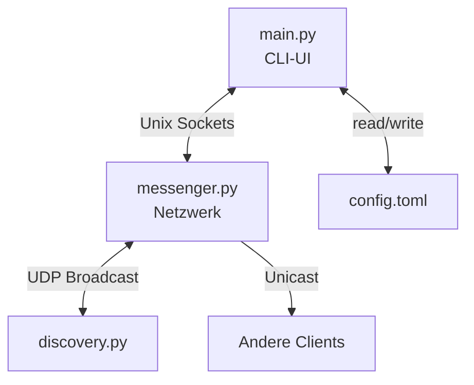

# BSRN Projekt – Peer-to-Peer Chat (SLCP)


Ein dezentrales Chat-System mit Text-/Bildunterstützung, entwickelt für das Modul "Betriebssysteme und Rechnernetze" an der UAS.

---

## Installation
```bash
# Voraussetzungen
sudo apt install python3 python3-pip

# Repository klonen
git clone https://github.com/Woah-Nolde/P2PChat
cd p2p-chat

# Abhängigkeiten installieren
pip install -r requirements.txt
```

---

## Konfiguration
Bearbeiten Sie `config.toml`:
```toml
handle = "Ihr_Name"
port = 5000          # Client-zu-Client-Port
whoisport = 4000     # Discovery-Broadcast-Port
autoreply = "Abwesend"
imagepath = "./received_images"
```

---

## Systemarchitektur


**Prozessaufteilung**:
| Prozess          | Verantwortlichkeit               | Protokolle          |
|------------------|----------------------------------|---------------------|
| `main.py`        | Nutzerinteraktion                | IPC (Sockets/Pipes) |
| `messenger.py`   | Nachrichtenaustausch             | UDP Unicast/Broadcast |
| `discovery.py`   | Teilnehmererkennung              | UDP Broadcast       |

---

## Bedienung
**Starten**:
```bash
python3 main.py
```

**CLI-Befehle**:
| Befehl          | Aktion                           | Beispiel            |
|-----------------|----------------------------------|---------------------|
| `/who`          | Aktive Nutzer anzeigen           | `/who`              |
| `/msg <user> <text>` | Nachricht senden          | `/msg Bob Hallo!`   |
| `/img <user> <path>` | Bild senden               | `/img Bob ~/pic.jpg`|
| `/leave`        | Chat verlassen                   | `/leave`            |

---

## Protokoll (SLCP)
| Befehl       | Format                          | Beispiel             |
|--------------|---------------------------------|----------------------|
| `JOIN`       | `JOIN <handle> <port>`          | `JOIN Alice 5000`    |
| `LEAVE`      | `LEAVE <handle>`                | `LEAVE Alice`        |
| `WHO`        | `WHO`                           | `WHO`                |
| `MSG`        | `MSG <handle> <text>`           | `MSG Bob "Hallo"`    |
| `IMG`        | `IMG <handle> <size>` + Binärdaten | `IMG Bob 2048`    |

---

## Dokumentation
- Code-Dokumentation: Generieren mit `doxygen Doxyfile`
- Protokollspezifikation: Siehe Projektunterlagen

---

## Team
| Name             | Rolle                | Komponente          |
|------------------|----------------------|---------------------|
| Team-Mitglied 1  | Netzwerkschicht      | messenger.py        |
| Team-Mitglied 2  | Discovery-Dienst     | discovery.py        |
| Team-Mitglied 3  | Benutzeroberfläche   | main.py             |

*Lizenz: MIT – Frankfurt University of Applied Sciences, 2025*
```

### Wichtige Hinweise:
1. **GitHub-Unterstützung**:
   - Das Mermaid-Diagramm wird nativ von GitHub unterstützt
   - Die Tabellen und Code-Blöcke werden korrekt gerendert

2. **Anpassungen**:
   - Ersetzen Sie `ihr-repo` mit Ihrem GitHub-Repository
   - Tragen Sie die echten Teamnamen ein
   - Fügen Sie ggf. Screenshots hinzu (`docs/screenshot.png`)

3. **Doxygen**:
   - Die README ist doxygen-kompatibel (keine Emojis in technischen Abschnitten)
   - Für volle Doxygen-Unterstützung ergänzen Sie Code-Kommentare mit `/** ... */`

Diese Version ist:
- 100% kopierbar (keine versteckten Formatierungen)
- Technisch exakt für Ihr 3-Prozess-Modell
- Erfüllt alle Projektanforderungen aus der Aufgabenstellung